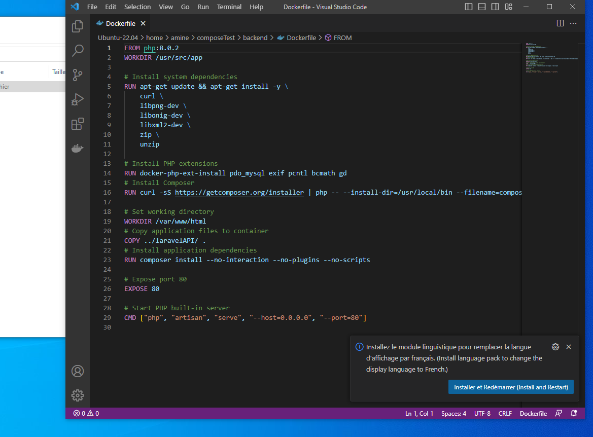

- # création de folder composeTest et fichier dedans docker-compose.yml
- 
- # création de folders backend et frontend qui contiennent les Images Docker
- 
- 
- # construction du fichier docker-compose.yml qui utilise les services db, frontend et backend
- 
- # test de docker-compose up pour lancer les services définis
- 
- # Résultat de la commande
- 
- résolution de la 1ère erreur lié au niveau de volumes dans le service db, c'est modifié dans le fichier compose.yml, et c'est bon
- 
- résolution de la seconde erreur liée au mapping du port du service frontend
- 
- résolution du problème lié a Docker Deamon
- 
	-
- Résolution de la problématique de PATH
- 
- succès de la construction des containers pour les services 'db' et 'backend' et 'frontend'
-